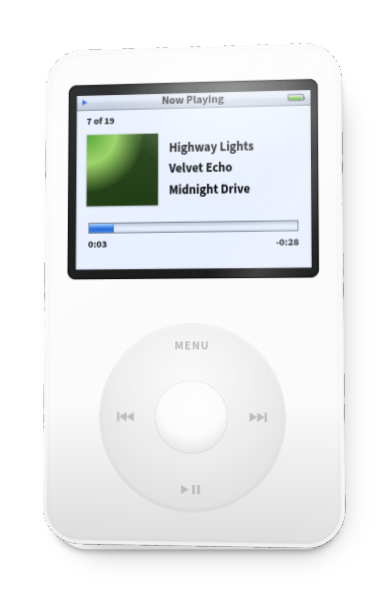
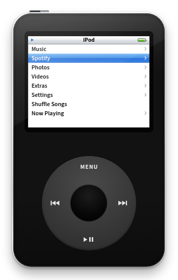
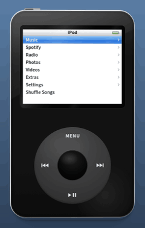

# iPod for Desktop

A frameless 3D iPod for your Windows or Mac desktop. Pick the original, mini, 5th generation, classic or nano 3G, then play your music, iTunes library, radio, podcasts or Spotify. [Changelog](CHANGELOG.md).

<p align="center">
  
  
</p>

## Features

<p align="center"></p>

**The iPod**
- Five models (Settings › Appearance › Model): original (2001), mini (2004), 5th generation (2005), classic (2007), nano 3G (2007). Sizes, screens, wheels, ports and colours are measured from Apple's specs and product images and iFixit's photos.
- A real 3D body (WebGL) that turns toward your pointer, lifts when dragged, floats when idle and flips over (double-click) to show the back and your engraving.
- Each model's own wheel (the original's turns), ports, materials and screen: monochrome Chicago LCDs, the 5th generation's blue menus, or the 2007 look with panning album art.
- Colours, a colour editor, four sizes, wear, reflections, click sounds, and an album-coloured Now Playing.

**Music**
- Cover Flow, playlists (including `.m3u` and smart playlists), artists, albums, songs, genres, composers, audiobooks, podcasts and search.
- Up Next, gapless or crossfade, shuffle, repeat, EQ, Sound Check, lyrics (LRCLIB), visualizer, ratings.
- Your iTunes or Music library: playlists, ratings and play counts (read-only).
- Internet radio (radio-browser.info) and podcasts (charts, search, OPML, downloads).
- Spotify: your library, search, queue and devices, played through the Spotify app or any Connect speaker.

**Extras**: games, clocks, alarms, sleep timer, stopwatch, screen lock, contacts, calendars, notes, photos and videos.

**Desktop**: tray or menu bar icon, global shortcuts, media keys, file drop and Open With, snapping, notifications, start at login, and automatic updates.

## Install

From the [Releases page](../../releases):

- **Windows 10/11:** `iPod-Setup-x.y.z.exe` (updates itself) or `iPod-Portable-x.y.z.exe`. On a SmartScreen warning: **More info › Run anyway**.
- **Mac (macOS 13+):** `iPod-x.y.z-mac-arm64.dmg` (Apple silicon) or `-x64.dmg` (Intel). The first time: **System Settings › Privacy & Security › Open Anyway**.

From source:

```bash
npm install
npm start        # run
npm test         # unit tests
npm run e2e      # end-to-end (needs ffmpeg; xvfb on Linux)
npm run dist     # build installers
```

**Releasing:** bump `version` in `package.json`, add a changelog entry, then **Actions › Build › Run workflow** with **Publish a GitHub release** ticked (or push a `v*` tag).

## Controls

| Mouse | Keyboard | Action |
| --- | --- | --- |
| Drag around the wheel, or scroll | ↑ ↓ | Scroll (volume in Now Playing) |
| Centre button | Enter | Select |
| MENU | Esc | Back (hold: main menu) |
| ▶❚❚ | Space | Play/pause (hold: off) |
| ⏮ ⏭ | ← → | Previous/next (hold: seek) |
| Hold switch | H | Lock |
| Drag / double-click the case | | Move / flip |

Global shortcuts: Space, arrows and I (show/hide) with Ctrl+Alt (Windows) or ⌃⌥⌘ (Mac).

## Your music

Reads your Music folder; add more in **Settings › Music Library**. Formats: MP3, AAC/M4A, M4B, FLAC, WAV, OGG, Opus. Artwork from tags or `cover.jpg`/`folder.jpg`.

**iTunes / Music app:** turn on "Share Library XML with other applications" (iTunes: Edit › Preferences › Advanced; Music: Settings › Files), then **Settings › Music Library › iTunes Library**.

## Spotify

**Settings › Spotify › Set Up Spotify…** walks you through it:

1. In the [Spotify Developer Dashboard](https://developer.spotify.com/dashboard), **Create app**.
2. Redirect URI `http://127.0.0.1:43827/callback`; tick **Web API** and **Web Playback SDK**.
3. Paste the **Client ID** into the iPod and **Connect**.

Playback needs Spotify Premium. Development Mode apps allow 5 users (add them under **User Management**) and only list playlists you own or collaborate on. Sign-in uses PKCE; tokens are stored with the system keychain.

## Project layout

```
src/main/       Electron main: window, tray, app:// server, library scanner, Spotify sign-in, updates
src/preload/    Bridge between the UI and the main process
src/renderer/   The iPod (plain ES modules)
  js/models.js    Every model's measurements, with sources
  js/device.js    Case, wheel and hold switch input
  js/body3d.js    3D body
  js/rig.js       Motion
  js/os.js        Navigation, backlight, title bar
  js/views/       Screens
  js/player/      Playback, Spotify engine, queue
  js/library/     Local library, Spotify API
scripts/        Icons, test library, end-to-end tests
test/           Unit tests
```

## Credits and legal

Unofficial fan project, not affiliated with Apple Inc. or Spotify AB. iPod and Click Wheel are trademarks of Apple Inc.; Spotify is a trademark of Spotify AB. 3D by [three.js](https://threejs.org) (MIT). Fonts: Source Sans 3 (SIL OFL 1.1, `src/renderer/fonts/OFL.txt`) and ChicagoFLF by Robin Casady (public domain, `src/renderer/fonts/chicago-flf-README.txt`).

MIT License.
